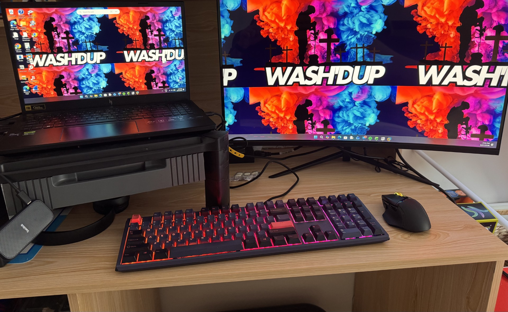
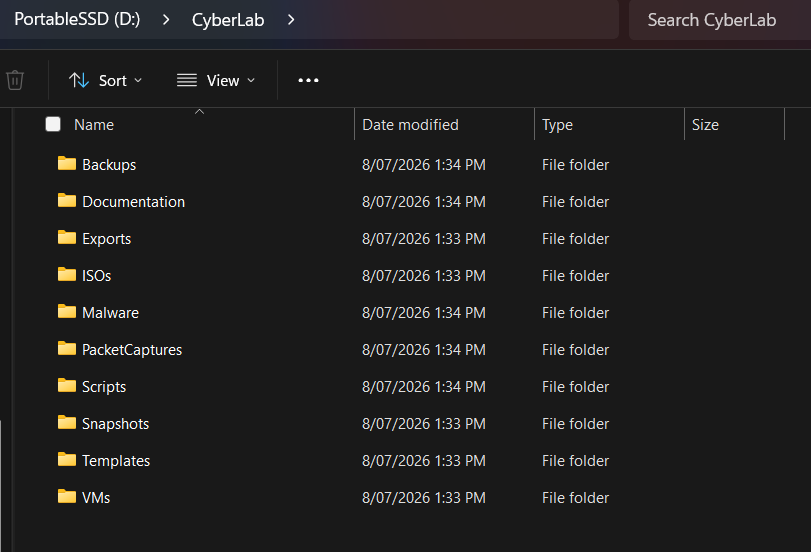
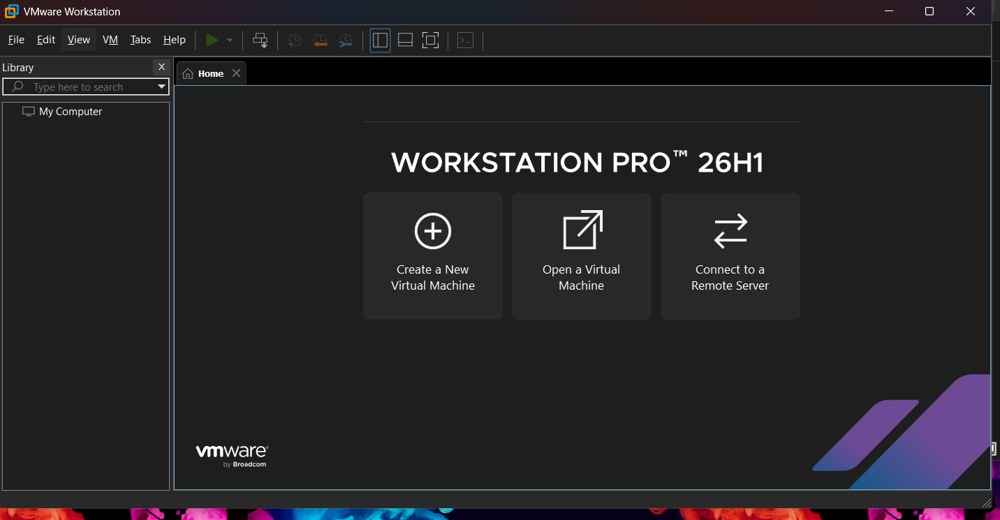
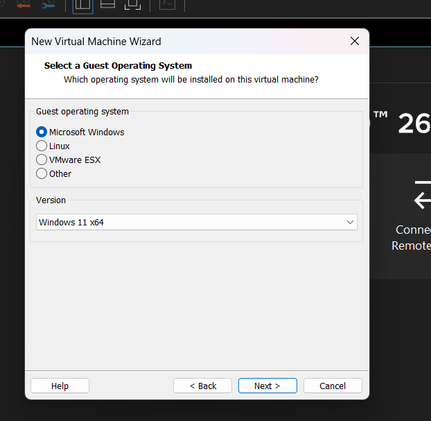
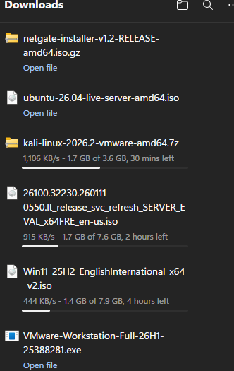
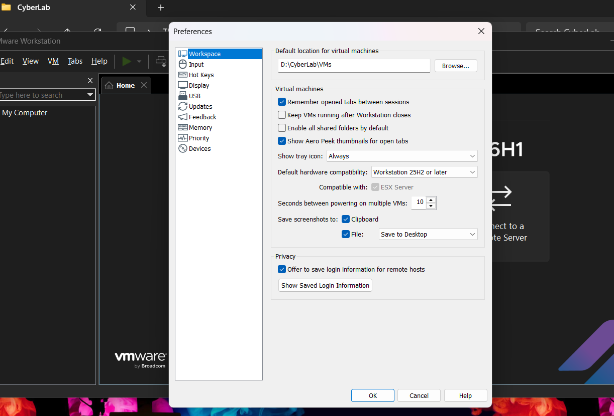
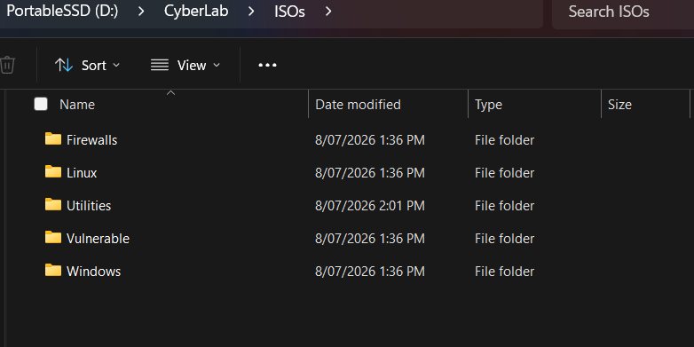

# Cybersecurity Home Lab - Day 1: Foundation & Environment Setup

**Project:** Cybersecurity Home Lab  
**Author:** Jace Cowan  
**Date:** 8 July 2026  
**Status:** Phase 1 Complete

---

# Overview

This project documents the design and implementation of my personal cybersecurity home lab. The objective is to create a scalable environment for learning offensive and defensive cybersecurity techniques while preparing for **CompTIA Security+**, **Hack The Box Academy**, and a career transition into cybersecurity.

Rather than relying solely on theoretical learning, this lab provides an isolated environment for building practical skills in:

- Windows Administration
- Linux Administration
- Networking
- Active Directory
- Firewalls
- Penetration Testing
- SIEM
- Threat Hunting
- Incident Response

---

# Objectives

The primary objectives of this project are:

- Build a dedicated cybersecurity lab using virtualization.
- Separate lab infrastructure from the host operating system.
- Create an environment suitable for both offensive and defensive security exercises.
- Develop practical experience that complements formal certifications.
- Document the entire build process to demonstrate technical capability and continuous learning.

---

# Host Hardware

| Component | Specification |
|-----------|---------------|
| Laptop | Acer Nitro V |
| CPU | Intel Core i9 |
| GPU | NVIDIA RTX 4060 |
| Memory | 32 GB DDR5 |
| Internal Storage | 1 TB NVMe SSD |
| Lab Storage | SanDisk Portable SSD 1 TB |
| Host Operating System | Windows 11 |

---

# Hypervisor Selection

After comparing **VMware Workstation Pro** and **VirtualBox**, **VMware Workstation Pro 26H1** was selected as the primary hypervisor.

### Reasons for this decision

- Excellent performance with multiple virtual machines
- Strong networking capabilities
- Reliable snapshot management
- Enterprise-level virtualization platform
- Better scalability for larger cybersecurity environments

---

# Storage Strategy

The lab has been designed to separate the hypervisor from virtual machine storage.

## Internal SSD

Installed applications include:

- VMware Workstation Pro
- Wireshark
- Security tools
- Supporting software

## External SSD

Dedicated storage for:

- Operating System ISOs
- Virtual Machines
- Snapshots
- Packet Captures
- Documentation
- Scripts
- Tools
- Backups

This approach allows the entire cybersecurity lab to be backed up, migrated, or expanded independently of the host operating system.

---

# CyberLab Directory Structure

```text
CyberLab
│
├── ISOs
│   ├── Windows
│   ├── Linux
│   ├── Firewalls
│   ├── Vulnerable
│   └── Utilities
│
├── VMs
│   ├── Windows11
│   ├── WindowsServer
│   ├── Kali
│   ├── Ubuntu
│   ├── pfSense
│   └── Templates
│
├── Snapshots
├── Exports
├── PacketCaptures
├── Malware
├── Tools
├── Scripts
├── Documentation
└── Backups
```

---

# Software Installed

- VMware Workstation Pro 26H1

---

# Operating Systems Downloaded

| Operating System | Purpose |
|------------------|---------|
| Windows 11 x64 | Client Workstation |
| Windows Server 2025 Evaluation | Active Directory, DNS, DHCP |
| Kali Linux (VMware Image) | Offensive Security & Penetration Testing |
| Ubuntu Server 26.04 LTS | Linux Administration & Services |
| pfSense CE | Firewall & Network Segmentation |

---

# Configuration Validation

The following configuration checks were successfully completed:

- ✅ VMware Workstation Pro installed successfully
- ✅ Intel VT-x hardware virtualization verified
- ✅ VMware virtual machine wizard launched successfully
- ✅ VMware configured to store virtual machines on the external SSD
- ✅ CyberLab directory structure created

---

# Challenges Encountered

## VMware Download Restrictions

The Broadcom download portal initially rejected registration using a personal email address due to account restrictions. After identifying the issue, VMware Workstation Pro was successfully obtained through the correct download process.

---

## Selecting Correct Installation Media

Several operating systems provided multiple download options including:

- ARM images
- Installation assistants
- Installation media
- Pre-built virtual machines

The following installation media were selected:

- Windows 11 x64 ISO
- Windows Server 2025 Evaluation ISO
- Kali Linux VMware Virtual Machine
- Ubuntu Server LTS ISO
- pfSense Virtual Machine ISO

Selecting the appropriate media ensures compatibility with VMware and simplifies deployment.

---

# Lessons Learned

Several important concepts were reinforced during the initial setup.

- Virtual machines should be stored separately from the host operating system whenever practical.
- VMware itself requires minimal storage compared to the virtual machines it manages.
- Proper directory organisation significantly simplifies long-term lab management.
- Hardware virtualization should always be verified before creating virtual machines.
- Different operating systems distribute installation media in different formats, requiring careful selection before download.

---

# Skills Developed

- Virtualization
- Storage Planning
- Windows Administration
- Lab Architecture
- Operating System Deployment Planning
- Cybersecurity Lab Design
- Technical Documentation

---

# Evidence

The following screenshots will accompany this write-up.

## Figure 1 – Home Lab Hardware



## Figure 2 – CyberLab Directory Structure



## Figure 3 – VMware Workstation Pro Installed



## Figure 4 – Hardware Virtualisation Verified



## Figure 5 – Operating System Downloads



## Figure 6 – VMware Preferences



## Figure 7 – ISO Repository



---

# Next Phase

The next phase of this project will include:

- Build Windows 11 Virtual Machine
- Import Kali Linux VMware Appliance
- Deploy Windows Server 2025
- Configure an Isolated Virtual Network
- Install and Configure Active Directory
- Deploy pfSense Firewall
- Prepare the Environment for SIEM
- Packet Analysis
- Penetration Testing
- Threat Hunting

---

# Reflection

The first phase focused on establishing a robust foundation rather than immediately deploying virtual machines.

Investing time in planning the storage layout, selecting the correct installation media, and validating the virtualization platform reduces future troubleshooting while creating a scalable cybersecurity environment capable of supporting progressively more advanced networking, system administration, penetration testing, and security monitoring exercises.

---

## Project Status

**Current Progress**

- ✅ VMware Installed
- ✅ Virtualization Verified
- ✅ CyberLab Folder Structure Created
- ✅ Operating Systems Downloaded
- ⏳ Windows 11 Virtual Machine
- ⏳ Kali Linux
- ⏳ Windows Server
- ⏳ Active Directory
- ⏳ pfSense
- ⏳ Splunk
- ⏳ Security Onion

---

**This repository will continue to be updated throughout the construction and expansion of the Cybersecurity Home Lab.**
