# Phase 02 – Windows 11 Client VM Build

## Overview

In this phase, I built the first endpoint for my cybersecurity home lab: a Windows 11 client virtual machine.

This machine will later be used for:

- Active Directory domain membership
- Windows event log analysis
- Sysmon monitoring
- SIEM log forwarding
- Network traffic capture
- Endpoint investigation
- Controlled attack simulation
- Blue-team detection exercises

The virtual machine was created using VMware Workstation Pro and stored on an external SSD.

---

## Objectives

The objectives of this phase were to:

- Create a Windows 11 virtual machine
- Store the VM on the external SSD
- Install Windows 11
- Configure a local Windows account
- Rename the computer
- Install VMware Tools
- Install core administration and investigation tools
- Apply Windows updates
- Create a clean VMware snapshot
- Document the build for GitHub

---

## Host Environment

The home lab is running on the following host system:

- Host operating system: Windows 11
- Processor: Intel Core i9
- Memory: 32 GB RAM
- Graphics: NVIDIA RTX 4060
- Internal storage: 1 TB SSD
- External lab storage: SanDisk 1 TB portable SSD
- Hypervisor: VMware Workstation Pro

---

## Virtual Machine Configuration

The Windows 11 virtual machine was created with the following configuration:

- Virtual machine name: `WIN11-CLIENT01`
- Guest operating system: Windows 11
- Storage location: External SSD
- Firmware: UEFI
- Processors: 4 number of processors = 1, number of cores per processor = 4 
- Virtual TPM: Enabled
- Network connection: VMware NAT during initial setup
- Account type: Local Windows account

The virtual machine files were stored on the external SSD to keep the lab environment separated from the host computer’s internal storage.

## Screenshots of configuration
### 1. Create a New Virtual Machine
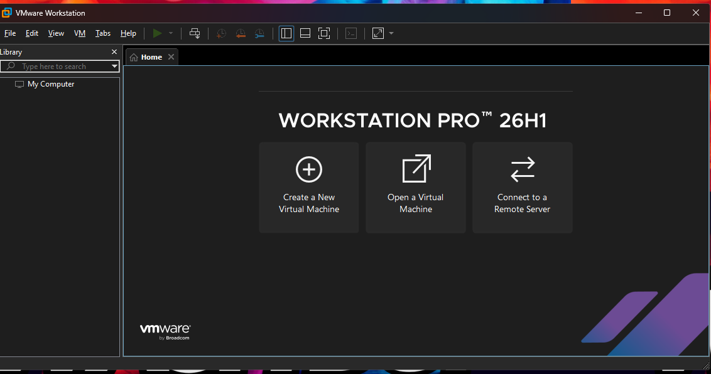
**Figure 01: Create a New Virtul Machine.**
This  is the main VMware Workstation interface. I selected **Create a New Virtual Machine to start building the Windows 11 client virtual machine.

### 2. Select the Windows 11 ISO
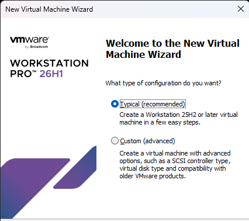
**Figure 02: New Virtual MAchine Wizard**
This is where the build starts, I selected Typical for a basic start up and install
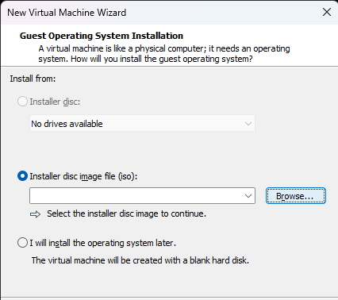
**Figure 03: Installer Disc Image File**
This Window is where I browsed and selected the Windows 11 ISO from my external SSD
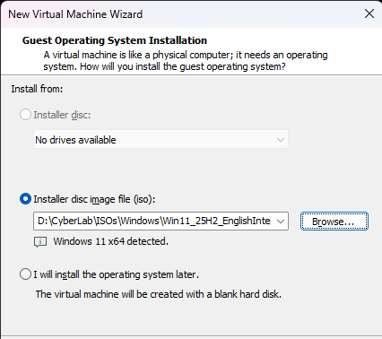
**Figure 04: Windows 11 ISO File Selected**
As seen here, I have successsfully selected the Windows 11 ISO File from my CyberLab Externall SSD

### 3. Name and Configure Settings
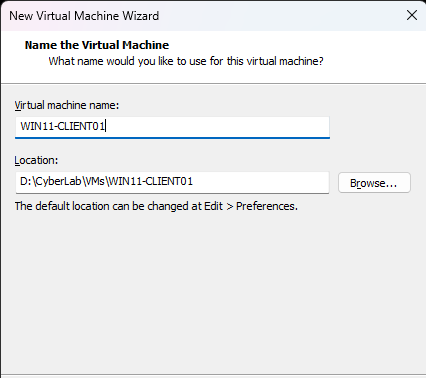
**Figure 05: Name the Virtual Machine**
Here I named the Virtual Machine 'WIN11-CLIENT01' This name give it a general description of what the VM is used for and numbering it as 01 allows me to futher develop my lab environment to expand the number of Windopws 11 Clients within my Active Directory at a later date. I also selceted the location of the build to be in my VMs folder of my CyberLab external SSD. This allows me to keep all my VMs external from my Host computer's SSD allowing for further development without reducing my Host performance and storage capacity.
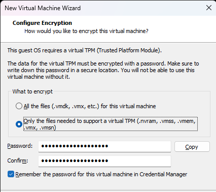
**Figure 06: Configure Encryption**
This screen requests you to configure how  you would like to encrpyt your VM, I selected the files supporting TPM as I don't need everything encrypted. I chose an easy password to remember.
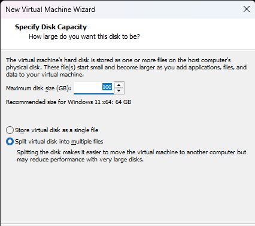
**Figure 07- Disk Capacity**
I increased the maximum disk size to 100GB, this is an increase from the recommmended 64GB for Win 11. This is to provide sufficient storage for the OS. It mallows Windows updates, VMware Tools, applicationas, log files and future Cybersecurity Tools to be installed throughout my projects.
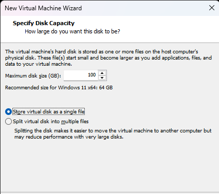
**Figure 08: Optimal Disk Settings**
These are the optimal Disk Settings. As seen in Figure 8 I have changed the Maximum Disk Size to 100GB and have selected to store virtual disk as a single File. The reason for this is for a modern Windows host using NTFS file system, storing the disk as a single file  generally provides a better performance and simplifies file management.
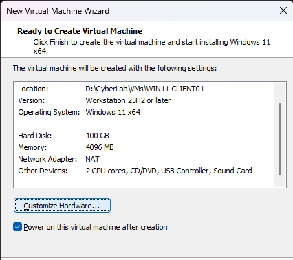
**Figure 09: Default Hardware**
VMWare selects the default hardware as seen in Figure 09. You can see here that the location, versions, OS and Disk Capacity we have already selected are shown. Here is where we are going to customize the hardware to fit our needs by increasing the memory to 8GB and using 4CPUs rather than 2.
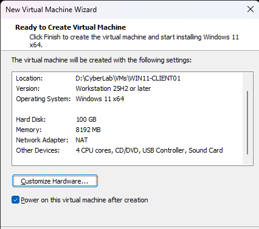
**Figure 10: Optimal Hardware**
As seen in Figure 10 we have increased memory and CPUs from clicking on the 'Customize Hardware' option. The reason for increasing the memory is although 4GB is enough to run Win11 it can be slightly sluggish, at 8GB it improves the responsiveness, allows multiple application to run simultaneously and supports Cybersecurity tools such as Wireshark, VS Code, Sysinternals Suite and Powershell more comfortablly. Since my Host L:aptop is 32GB or RAM allocating 8GB to this VM leaves approx 24GB  available to the host OS and any additional VMs that may be running.
The increase of CPUs to 4 allows faster installation of Windows and applications, improved multitasking performance, better responsiveness when analysing network traffic or running cybersecurity tools and is a more realistic workstation performance.
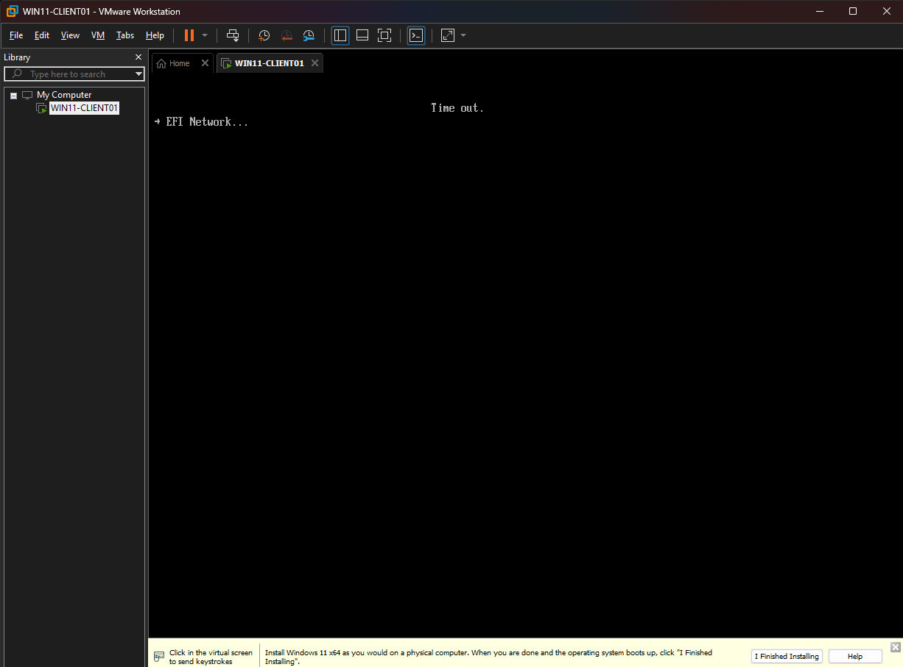
**Figure 11: Ready for Install**\
Figure 11 now shows the configuration of the VM is complete and the next screen will show the start to the Windows 11 install

---

## Windows 11 Installation

Windows 11 was installed using an official Windows installation ISO.

During installation, I chose not to connect the virtual machine to my personal Microsoft account. Instead, I completed the setup using a local Windows account.

This keeps the home lab separate from my personal accounts and prevents unnecessary synchronisation between the virtual machine and my primary computer.

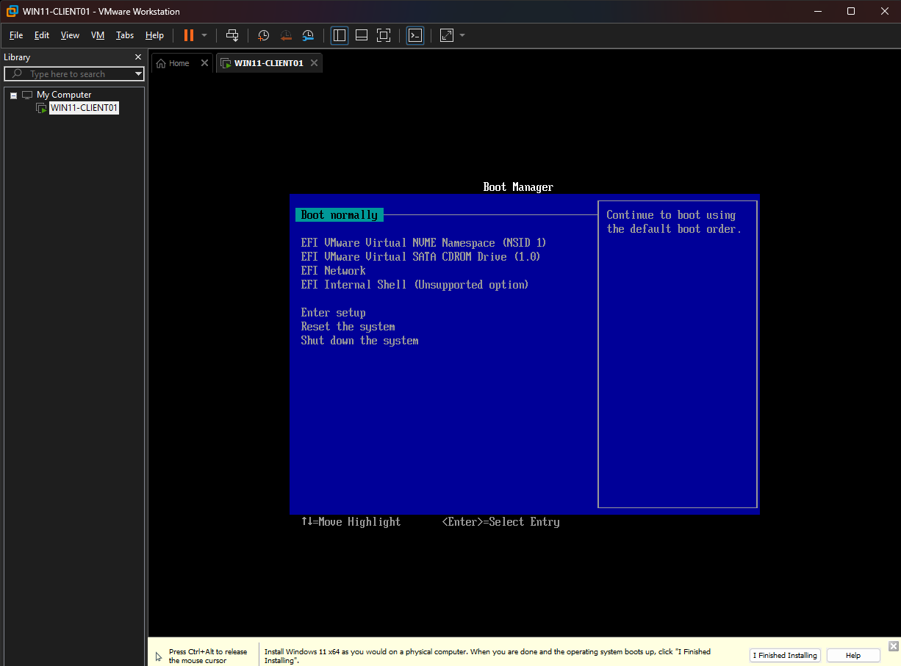
**Figure 12: Boot Manager**
This is the start of the OS Windows 11 Install, We select 'Boot Normally' to allow the Install to start.
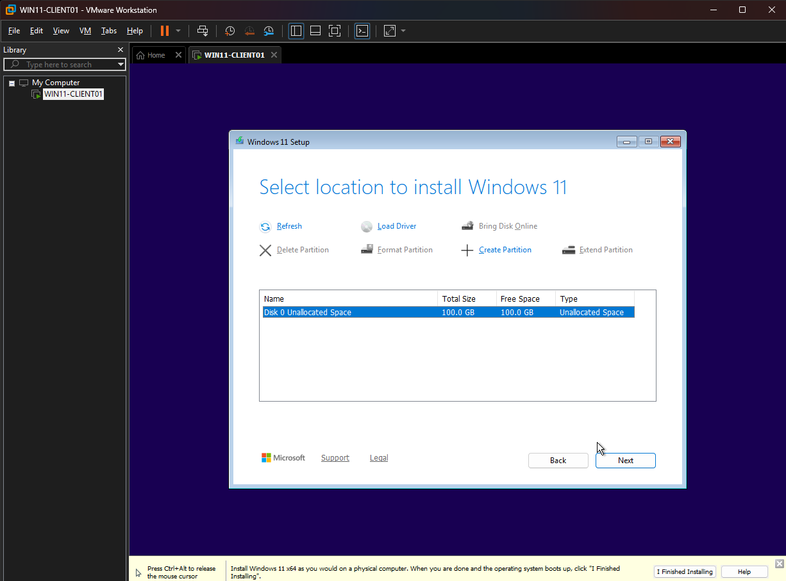
**Figure 13: Select Install Location**
As seen in figure 13 the location of the install is the 100GB disk we configured in the first step, we sewlect this as our install location.
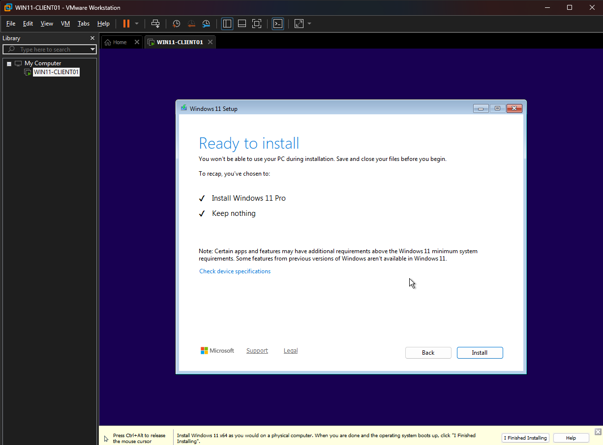
**Figure 14: Ready to Install**
Windows 11 Setup window now says it is ready to install, it is going to install Windows 11 Pro from our ISO file and Keep Nothing. The reason it is keeping nothing is because we are setting this up as a new computer, there are no files we need to keep because it is a clean build not an update of an OS.
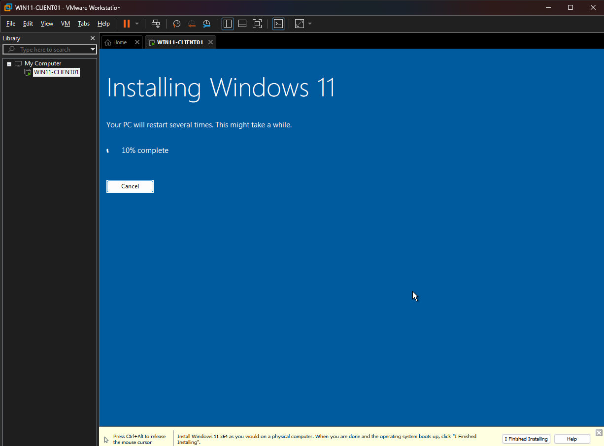
**Figure 15: Installing Windows 11**
This window now shows the progress of installing windows. Now we wait for the install to complete before we name and move on with our windows setup.
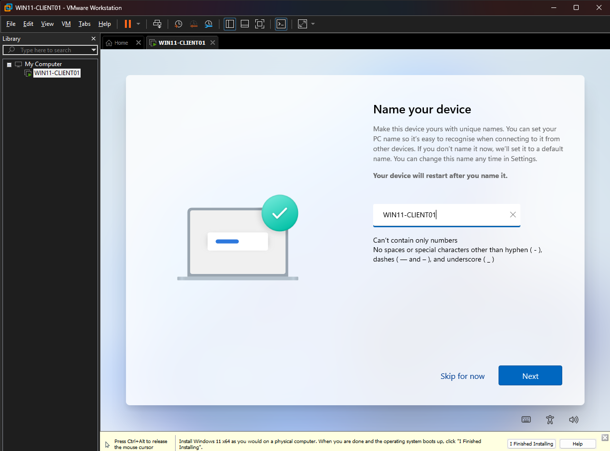
**Figure 16: Name Device**
As before when name the Virtual Machine we called it 'WIN11-CLIENT01' we do the same here,  consistent naming convention will make it easier to identify systems as the home lab expands to include additional Windows clients, servers, Linux machines, firewalls and monitoring systems.
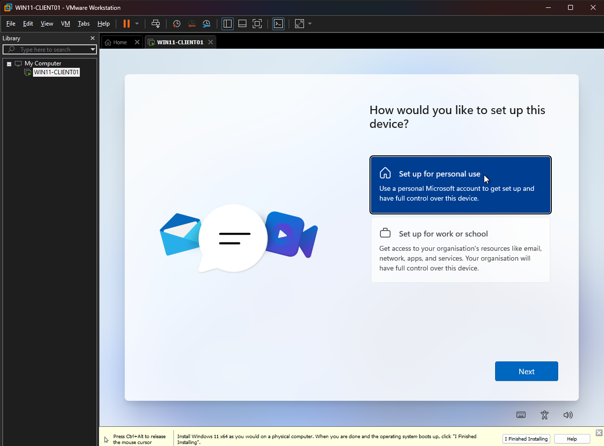
**Figure 17: Set Up Device as Personal**
Next step is to set up our device. We are going to set it up as a personal use computer, the reason for this is school or work would require us to log in to a corporate business structure account, we do not have this and we are realistically creating our own eventually with different OS and structures. So here select personal.
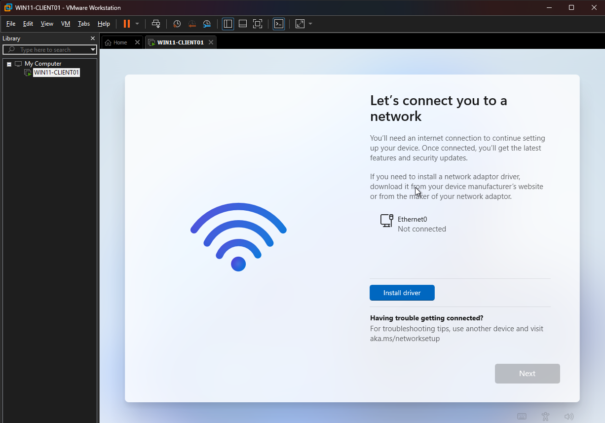
**Figure 18- Connect to a netwrok**
During the installation the Out-Of-Box-Experience 'OOBE' prompted for ann internet connection and to log in to a personal Microsoft Account before completing the build. As this is a home lab i did not want to connect my own Microsoft account to the build. So I avoided connecting to the network at the start. As seen in figure 18 there is no option to continue without internet, therefore I needed to bypass the OOBE.
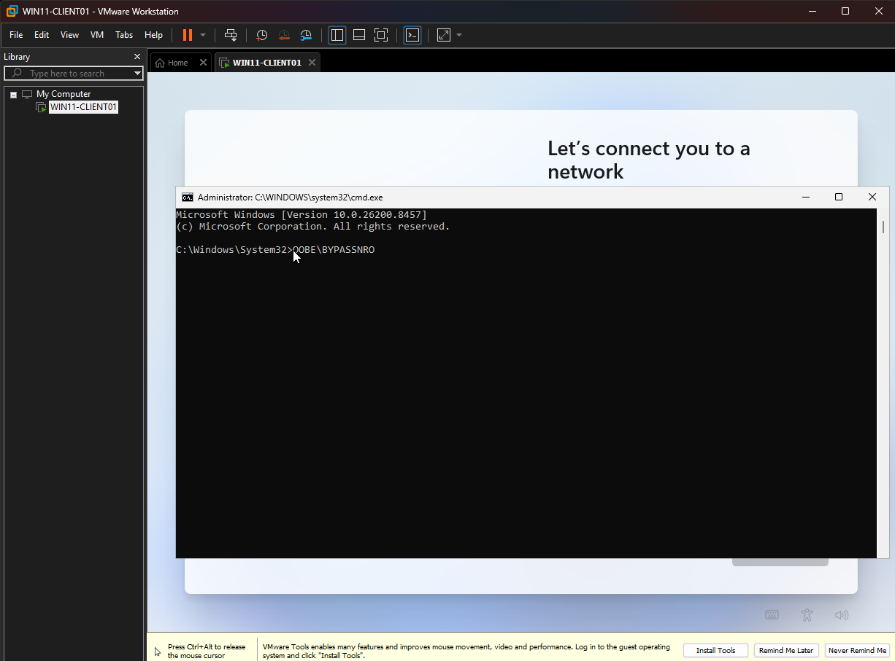
**Figure 19: CMD Prompt to Bypass OOBE**
To bypass the OOBE I opened the CMD Prompt using 'Shift + F10' keyboard shortcut. openeing the command prompt allows administrators to perform troubleshooting, execute configuration commands and modify parts of installation processes. In the CMD Prompt screen I used the CMD 'OOBE\BYPASSNRO' which modifies the Windows Out-Of-Box Experience by enabling the 'I don't have internet' option during setup. after the command is executed Windows automatically restarts the OOBE process.
1[Figure-20- Restarted OOBE](screenshots/figure-20-bypass-network3.png)
**Figure 20: Restarted OOBE**
Now that Windows OOBE has restarted we can see the option 'I don't have internet' at the bottom, we click this and can now set up Windows 11 without internet and not required to log into a Microsoft Account. 
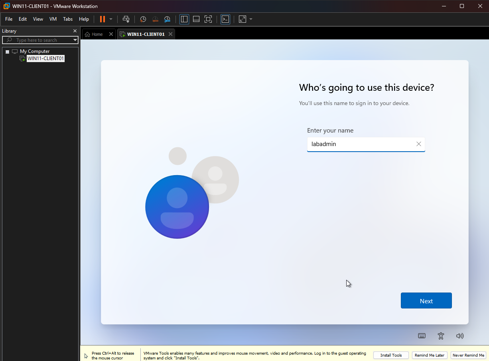
**Figure 21: Who is using this device**
Now that we have bypassed the network connection and signing into a Microsfot Account, Windows want's to know who is using the account, this is just creating a user log in. I have named mine labadmin as this is easy to remember, next is create the password for this log in and the security questions which I have not shown for security reasons. 

---

## VMware Tools Installation

VMware Tools was installed inside the Windows 11 virtual machine using the Typical installation option.

VMware Tools provides:

- Improved virtual display drivers
- Automatic screen resizing
- Better mouse and keyboard integration
- Improved guest operating system performance
- Clipboard and drag-and-drop integration when enabled
- Better communication between VMware and the guest operating system

The virtual machine was restarted after the installation was completed.

---

## Installed Tools

The following tools were installed or prepared on the Windows 11 client:

| Tool | Purpose |
|---|---|
| VMware Tools | Provides VMware drivers and guest integration |
| Visual Studio Code | Used for scripts, configuration files and documentation |
| Git | Provides version control and GitHub integration |
| 7-Zip | Used to extract compressed files and tool archives |
| Sysinternals Suite | Provides Windows administration and investigation tools |
| Web browser | Used to access documentation and download authorised tools |

---

## Sysinternals Suite

The Microsoft Sysinternals Suite was downloaded and extracted to:

`C:\Tools\Sysinternals`

Sysinternals tools are portable applications and do not require a normal installation process.

The main tools reviewed during this phase were:

### Process Explorer

Process Explorer provides a detailed view of running processes, parent-child relationships, loaded files and system activity.

### Process Monitor

Process Monitor records real-time file system, registry, process and thread activity.

### Autoruns

Autoruns identifies programs, services and scheduled tasks that automatically start with Windows.

### TCPView

TCPView displays active TCP and UDP connections, listening ports and the processes associated with them.

---

## Windows Updates

Windows Update was run after the initial installation.

Installing current Windows updates created a more secure and stable baseline before the system is connected to other home-lab machines.

---

## Clean Snapshot

After the operating system and core tools were installed, the virtual machine was shut down and a clean VMware snapshot was created.

Snapshot name:

`WIN11-CLIENT01 - Clean Build`

This snapshot provides a known-good recovery point before the system is:

- Joined to an Active Directory domain
- Connected to an isolated lab network
- Configured with Sysmon
- Connected to a SIEM
- Used in attack and detection exercises

---

## Problems Encountered

### Microsoft Account Setup

Windows encouraged the use of an online Microsoft account during setup.

**Resolution:**  
The network connection was disconnected and the Windows installation was completed using a local account.

### VMware Display and Integration

Before VMware Tools was installed, the virtual display and mouse integration were limited.

**Resolution:**  
VMware Tools was installed using the Typical setup option, followed by a restart of the virtual machine.

### Sysinternals Installation

The Sysinternals Suite did not use a traditional installer.

**Resolution:**  
The downloaded ZIP archive was extracted to `C:\Tools\Sysinternals`, and the required applications were launched directly from that folder.

---

## Security Considerations

The following precautions were used during the build:

- No personal Microsoft account was connected to the VM
- No personal documents were intentionally stored inside the VM
- No personal credentials were added to the VM
- Testing will only be conducted against systems owned and controlled within the home lab
- Snapshots will be created before major configuration changes
- The lab will later be placed behind a dedicated virtual firewall
- Intentionally vulnerable systems will remain isolated from the normal home network

---

## Skills Developed

This phase provided practical experience in:

- Creating a VMware virtual machine
- Installing Windows 11 in a virtual environment
- Configuring a local Windows account
- Naming a system using a consistent lab convention
- Installing VMware guest drivers
- Installing and organising Windows administration tools
- Using Microsoft Sysinternals utilities
- Applying Windows security updates
- Creating VMware recovery snapshots
- Writing technical documentation using Markdown
- Organising screenshots for a GitHub portfolio

---

## Next Phase

The next phase will involve building a Kali Linux virtual machine.

The Kali Linux VM will eventually be used for:

- Network discovery
- Nmap scanning
- Service enumeration
- Vulnerability assessment
- Web application testing
- Controlled penetration-testing exercises
- Generating activity for blue-team investigation

The Kali VM will be used only against authorised systems contained within the home lab.

---

## Build Status

- [x] Windows 11 VM created
- [x] VM stored on external SSD
- [x] Windows 11 installed
- [x] Local Windows account configured
- [x] Computer renamed to `WIN11-CLIENT01`
- [x] VMware Tools installed
- [x] Visual Studio Code installed
- [x] Git installed
- [x] 7-Zip installed
- [x] Sysinternals Suite extracted
- [x] Windows updates completed
- [x] Clean VMware snapshot created
- [ ] Wireshark installed
- [ ] Nmap installed
- [ ] Sysmon configured
- [ ] Active Directory domain joined
- [ ] SIEM agent installed
- [ ] Lab firewall connection configured
