# Phase 03 - Kali Linux Attack VM Build 

## Overview
In this phase, I built the dedicated Linux attacker workstation for my cybersecurity home lab.

This Virtual Machine serves as the primary offensive security platform and will be used throughout future penetration testing, reconnaissance, vulnerability assessment, network analysis and red-team simulation exercises.

The virtual machine was built manually from the official Kali Linux installer rather than importing a pre-built image. This provided a deeper understanding of the Linux installation process, virtual hardware configuration, storage management and system configuration while creating a documented and repeatable build process.

Following installation, the operating system was updated, VMware integration tools were installed, networking was verified, security tools were validated and a clean baseline snapshot was created before any practical lab work begins.

---

## Objectives

The objectives of this phase were to:
- Build a dedicated Kali Linux attacker virtual machine
- Configure VMware virtual Hardware
- Install Kali Linux from the official installer ISO
- Configure networking using NAT
- Configure disk partitions
- Install the XFCE desktop environment
- Update the operating system
- Install VMware integration tools
- Verify system identity and connectivity
- Validate core penetration testing tools
- Create a clean recovery snapshot
- Document the complete build process

---

## Host Environment

| Host OS | Windows 11 Pro |
| Processor | Intel Core I9 |
| Memory | 32GB RAM |
| Graphics | NVIDIA RTX 4060 |
| Hypervisor | VMware Workstation Pro |
| Storage | SanDisk 1TB Portable SSD |
| Virtual Machine Storage Location | D:\CyberLab\VMs\Kali |

---

## Virtual Machine Specifications

| **Component** | **Configuration** |
| :---: | :---: |
| VM Name | KALI-ATTACK01 |
| Operating System | Kali Linux 2026.3 |
| CPU | 1 Processor/ 4 Cores |
| Memory | 8GB |
| Storage | 80GB Virtual Disk |
| Disk Format | Single File |
| Netowrk | NAT |
| Desktop Environment | XFCE |
| Architecture | 64-bit |

---

## Build Process

---

### 1. Creating a Custom VMware Virtual Machine

The virtual machine was created using VMware Workstation Pro's **Custom (Advanced)** configuration rather than the default "Typical" installation.

Using the advanced configuration provided full control over the virtual hardware, storage layout and networking configuration, allowing the virtual machine to be built consistently with the rest of the home lab.

Choosing the custom configuration also provides a better understanding of how VMware presents hardware to guest operating systems.

**Figure 01.** Creating a Custom VMware Virtual Machine

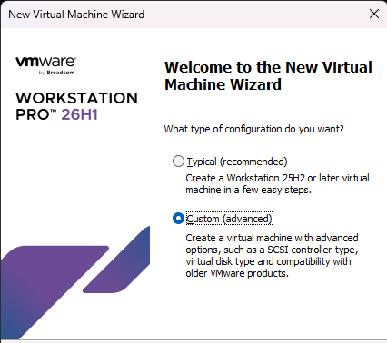

### 2. Preparing the Installation Media Repository

The Kali Linux installer ISO was stored within the dedicated CyberLab ISO Repository on the external SSD.

Maintaining a structured repository for installation media improves organisation, allows virtual machines to be recreated quickly and keeps all lab resources separate from the host operating system.

**Figure 02.** Preparing the Installation Media Repository

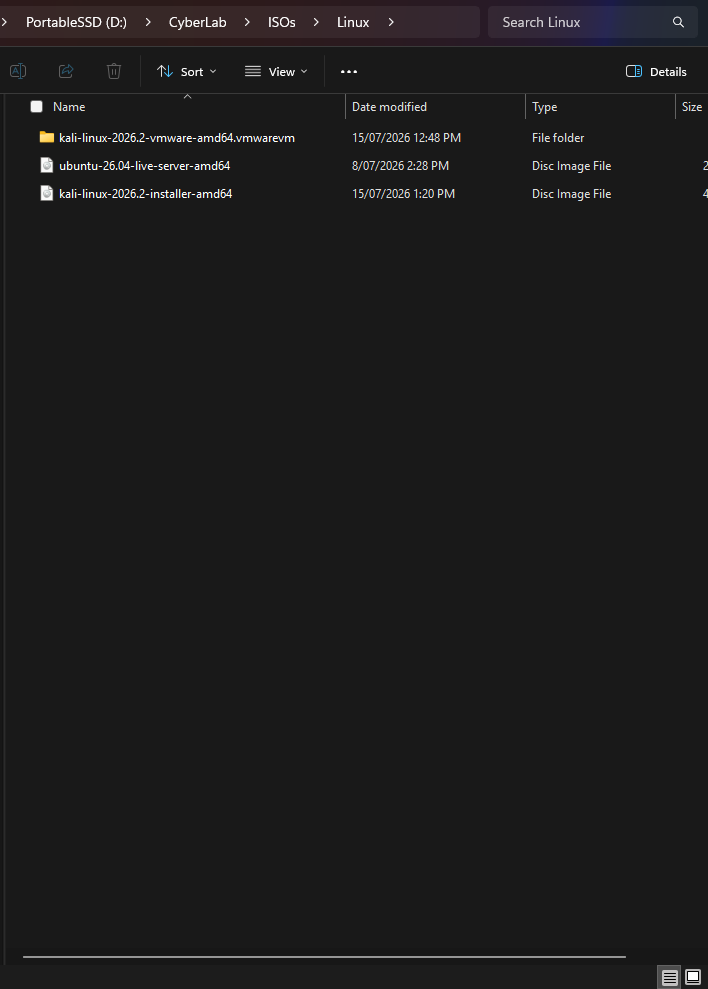

### 3. Selecting VMware Hardware Compatibility

The virtual machine hardware compatibility was configured for VMware Workstation 25H2.

Using the latest hardware compatibility ensures access to modern virtual hardware features while maintaining compatibility with the current VMware version.

**Figure 03.** Selecting VMware Hardware Compatibility

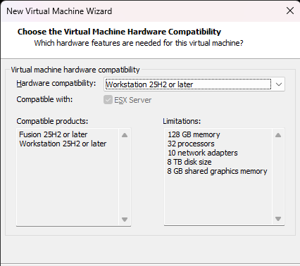

### 4. Attaching the Kali Linux Installation ISO

The official Kali Linux installer ISO was attached as the installation media.

Although VMware could not automatically detect the operating system, manually selecting the correct Linux version ensured the virtual hardware would be configured appropriately.

**Figure 04.** Attaching the Kali Linux Installation ISO

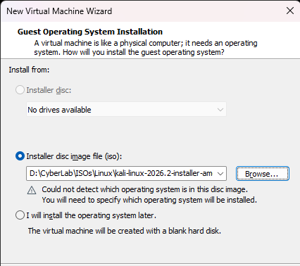

### 5. Selecting the Guest Operating System

Debian13.x 64-bit was selected as the guest operating system.

Kali Linux is based on Debian, making this the correct choice for optimising VMware drivers and hardware compatibility.

**Figure 05.** Selecting the Guest Operating System

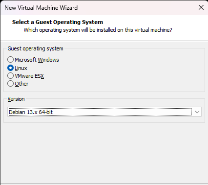

### 6. Naming the Virtual Machine

The virtual machine was named KALI-ATTACK01.

A consistent naming convention has been adopted across the home lab to simplify documentation, identification and future expansion.

As additional attacker systems are created, sequential numbering can be used without changing the naming structure.

**Figure 06.** Naming the Virtual Machine

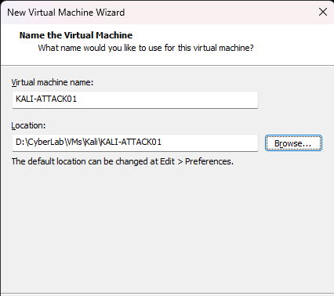

### 7. Configuring Virtual Processors

The virtual machine was allocated one processor with four virtual CPU cores.

This configuration provides sufficient processing power for reconnaissance, vulnerability scanning and packet analysis while maintaining adequate resources for the host computer and additional virtual machines.

**Figure 07.** Configuring Virtual Processors

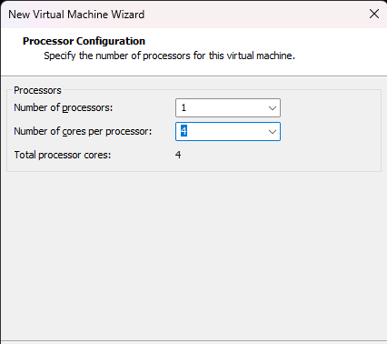

### 8. Configuring Memory Allocation

The virtual machine was allocated 8 GB of RAM.

Although Kali Linux can operate with significantly less memory, allocating 8 GB provides improved responsiveness when running multiple security tools simultaneously and supports larger scanning activities.

**Figure 08.** Configuring Memory Allocation

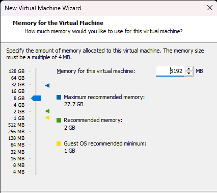

### 9. Configuring Network Connectivity

The virtual machine was configured to use VMware Network Address Translation (NAT).

NAT allows the virtual machine to access external networks through the host while remaining isolated from the physical network.

This configuration is appropriate for a controlled home lab where Internet connectivity is required while reducing unnecessary exposure.

**Figure 09.** Configuring Network Connectivity

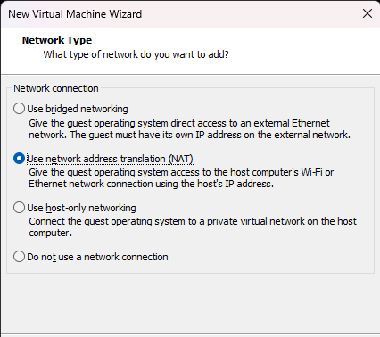

### 10. Configuring Virtual Disk Storage

An 80 GB virtual disk was created and stored as a single file.

The larger the storage capacity provides sufficient space for a security tools, captured network traffic, worklists, project files and future lab data.

Storing the disk as a single file generally provides slighlty improved performance while simplifying backup and management.

**Figure 10.** Configuring Virtual Disk Storage

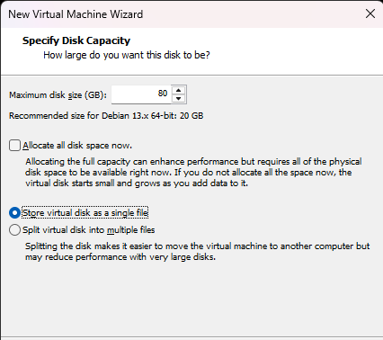

### 11. Reviewing Virtual Hardware Configuration

The virtual hardware configuration was reviewd before powering on the virtual machine.

Reviewing the CPU, memory, networking and display settings before installation reduces the likelihood of configuration issues later in the build.

**Figure 11.** Reviewing the Hardware Configuration

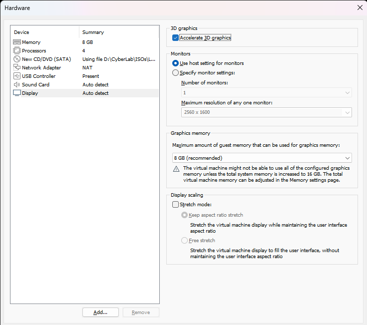

## 12. Launching the Kali Installer

The graphical installer was selected to begin the operating system installation.

The graphical installer provides a structured installation process while exposing the underlying Linux configuration options.

**Figure 12.** Launching the Kali Installer

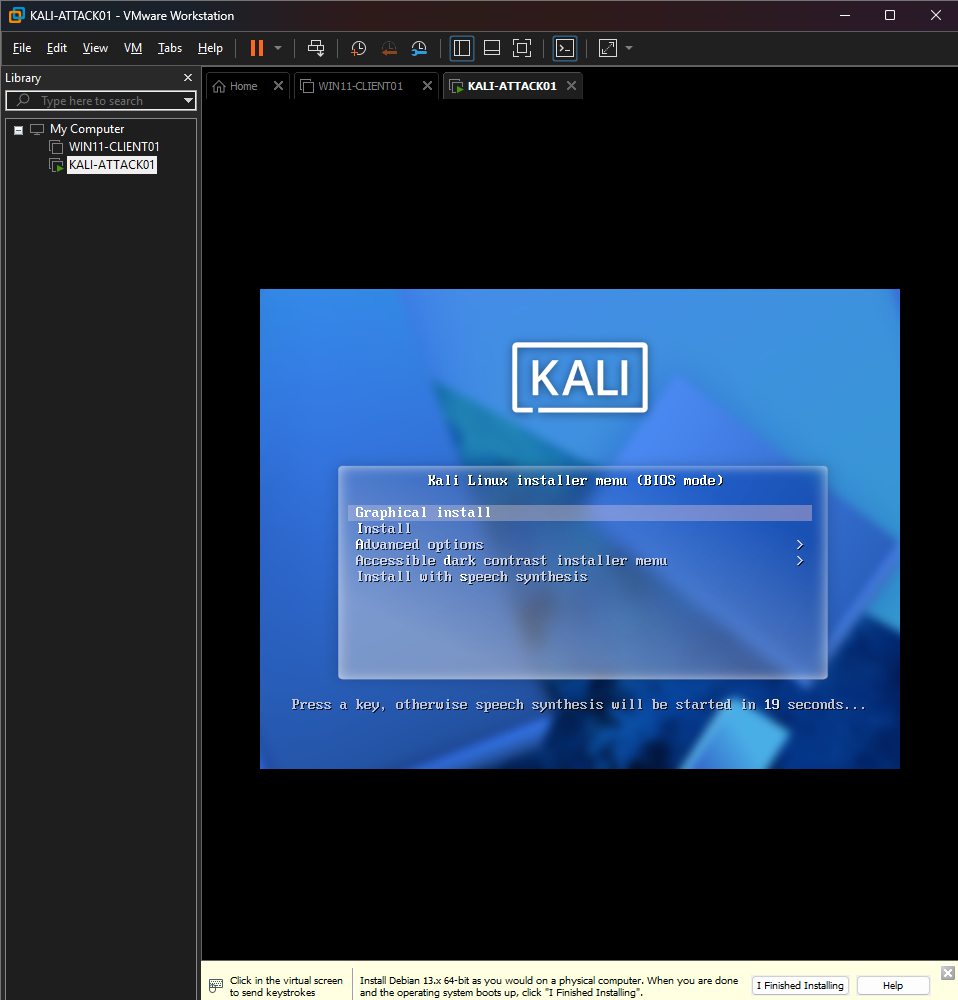

### 13. Configuring the Hostname

The hostname kali-attack01 was configured.

Using meaningful hostnames assists with identification during network reconnaissance, documentation and multi-machine lab exercises.

**Figure 13.** Configuring the Hostname

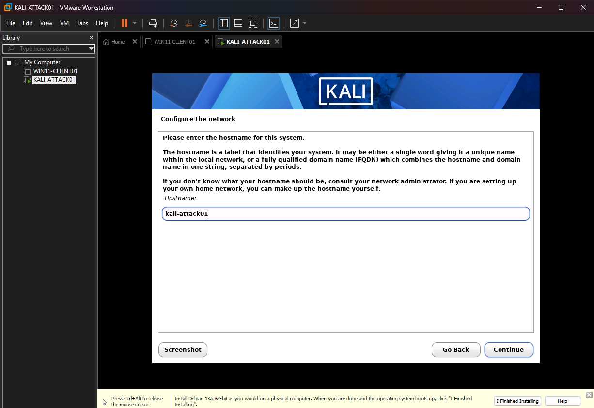

### 14. Creating the Administrative User

A dedicated administrative account named **labadmin** was created. Using a dedicated user account rather than generic usernames promotes consistency across the home lab while reflecting standard administrative practices. 

**Figure 14.** Creating the Administrative User

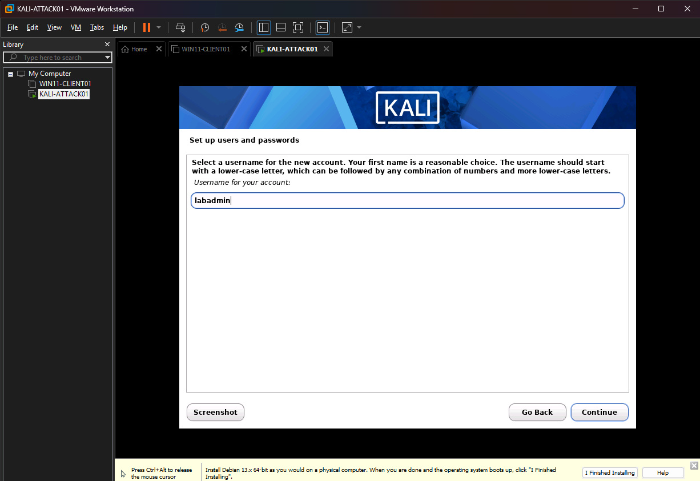

### 15. Selecting the Disk Partition Layout

The guided partitioning option was selected using a single root partition.

For a laboratory environment, a single partition simplifies the system management while providing sufficient flexibility for future projects.

**Figure 15.** Selecting the Disk Partition Layout

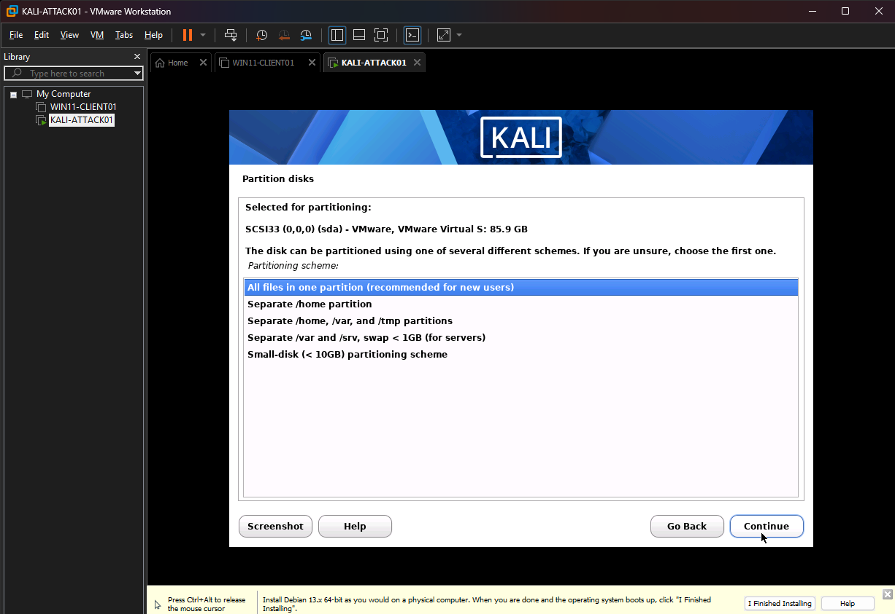

### 16. Reviewing the Partitioning Configuration

The installer displayed the final storage configuration prior to writing changes to disk.

The layout included a ext4 filesystem and a dedicated swap partition.

Reviewing partition layouts before committing changes is an important validation step during operating system deployment.

**Figure 16.** Reviewing the Partitioning Configuration

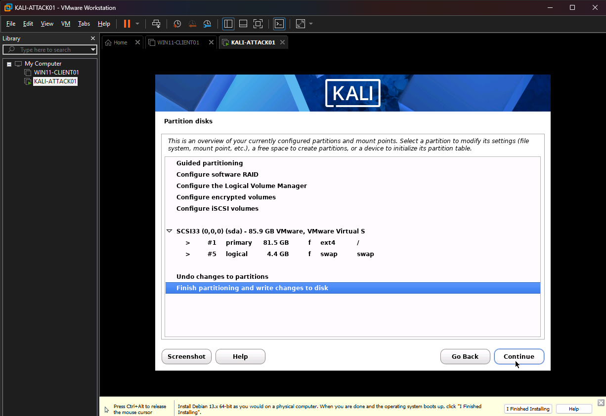

### 17. Selecting the Software Packages

The XFCE desktop environment and Kali's default toolset were selected.

The XFCE desktop offers excellent performance within virtual machines while providing access to Kali's standard penetration testing tools.

**Figure 17.** Selecting the Software Packages

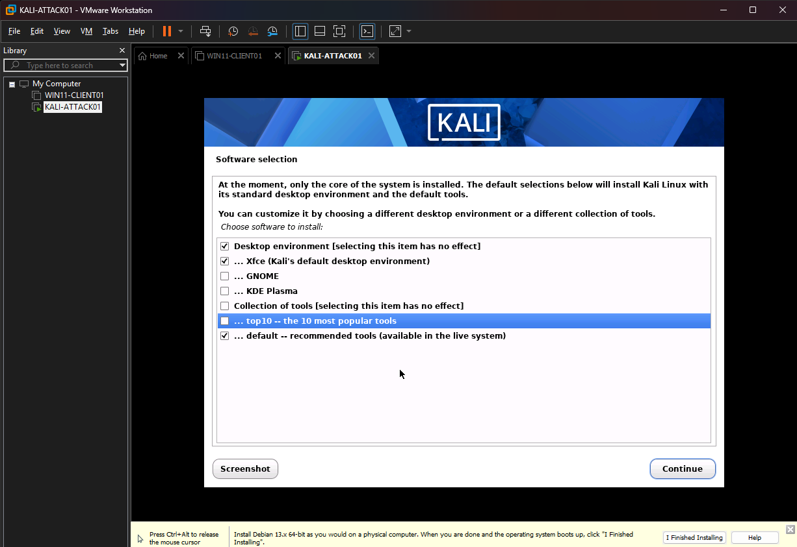

### 18. Installing the GRUB Boot Loader

The GRUB boot loader was installed onto the primary virtual disk.

Installing the boot loader ensures the operating system can boot correctly after installation.

**Figure 18.** Installing the GRUB Boot Loader

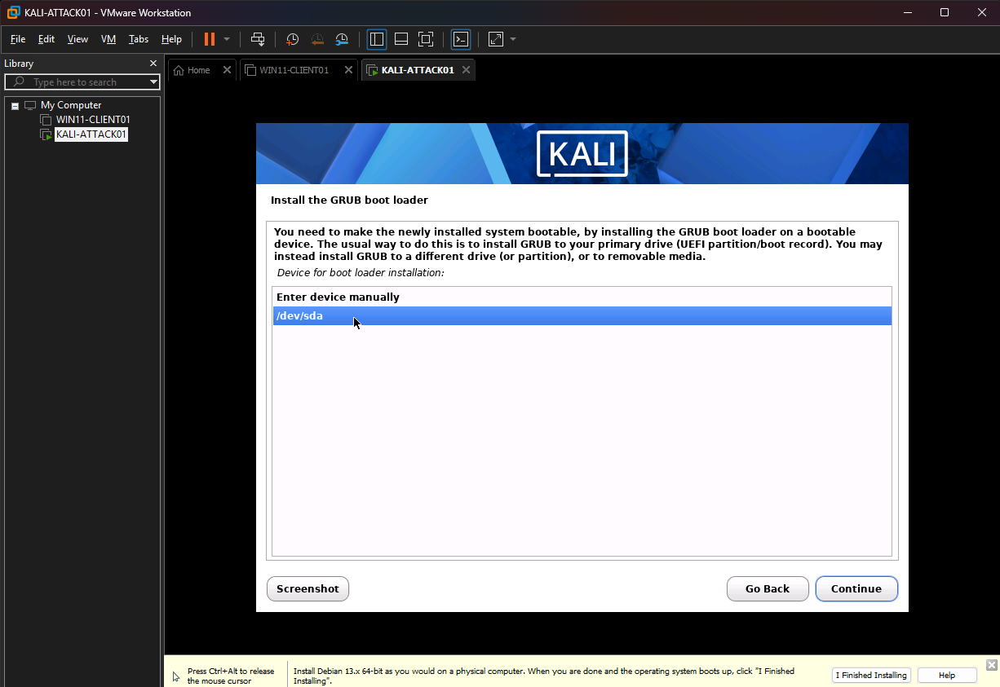

### 19. First System Logon

The system successfully booted into the Kali Linux login screen.

This confirmed that installation completed successfully and that the operating system was ready for initial configuration.

**Figure 19.** First System Logon

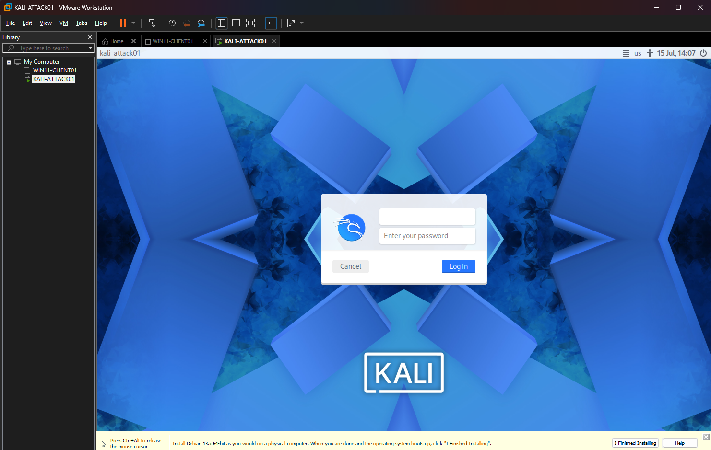

### 20. Verifying System Identity

The Linux command "hostnamectl" was executed to validate the operating system installation.

This command confirmed the hostname, operating system, kernel version, system architecture and virtual hardware configuration

Performing validation immediately after installation establishes confidence that the system has been configured correctly. 

**Figure 20.** Verifying System Identity

### 21. Verifying Network Configuration

The network interface configuration was reviewed using the "ip a" command.

This verified that VMware successfully assigned an IP address through NAT while confirming interface status and connectivity.

Sensitive addressing information has been intentionally obscured

**Figure 21.** Verifying Network Configuration

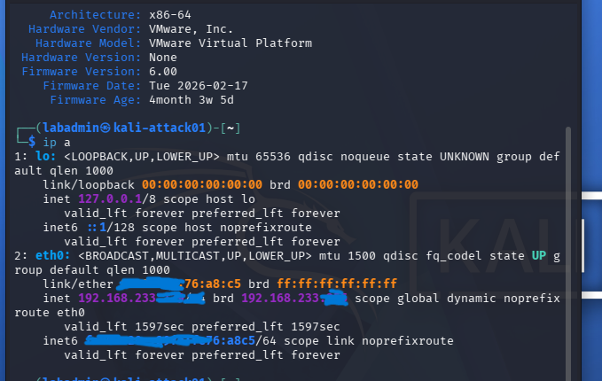

### 22. Verifying External Connectivity

Network connectivity was validated successfully pinging both Google's public DNS server (8.8.8.8) and kali.org

Successful responses confirmed:
 - Network connectivity
 - Internet access
 - DNS resolution
 - Proper NAT configuration

These checks verified that the virtual machine was ready to download updates and additional tools

**Figure 22.** Verifying External Connectivity

### 23. Updating the Operating System

The operating system package repositories were synchronised and all available updates were installed.

Maintaining an up-to-date operating system is an essential security practice and ensures future lab activities are performed using the latest software versions and security patches.

**Figure 23.*** Updating the Operating System

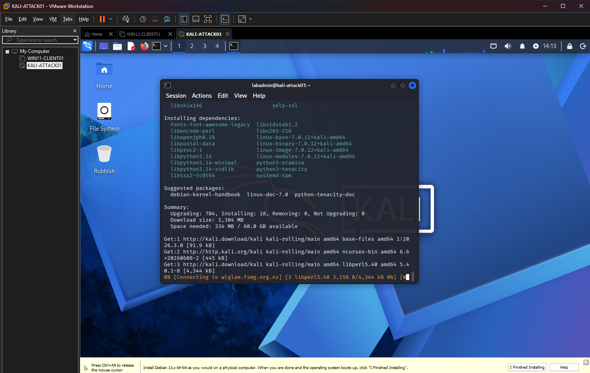

### 24. Completing System Maintenance

Following the update process, unnecessary packages were removed and the system rebooted.

Routine maintenance reduces unnecessary software, frees disk space and ensure the latest kernel and system components are fully loaded.

**Figure 24.** Completing System Maintenance

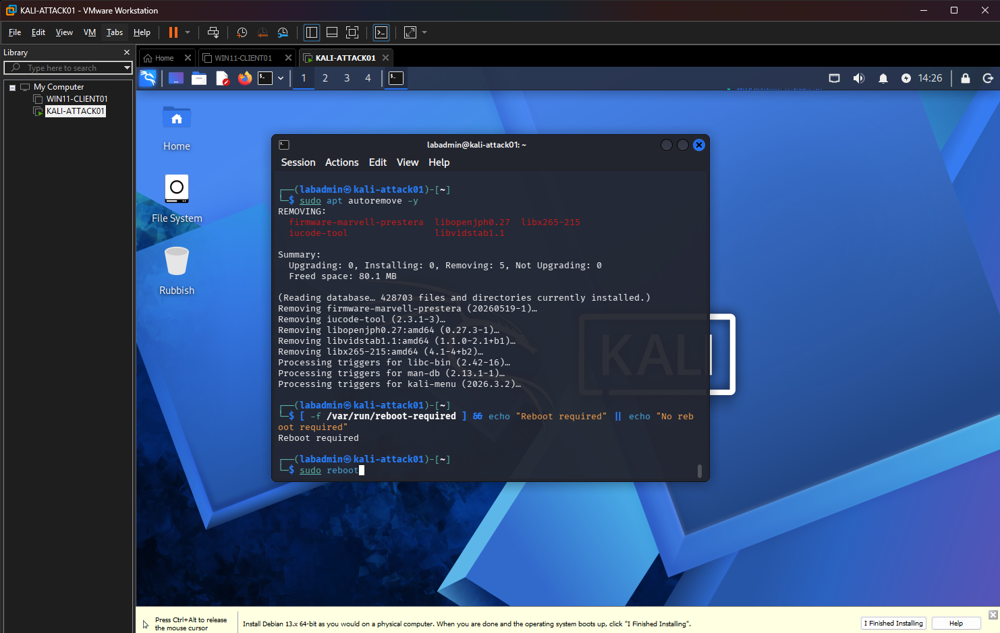

### 25. Installing VMware Guest Integration Tools

VMware Guest Tools were installed to improve integration between the guest operating system and the VMware hypervisor.

These tools provide improved graphics performance, mouse integration, clipboard sharing and enhanced virtual hardware support.

**Figure 25.** Installing VMware Guest Integration Tools

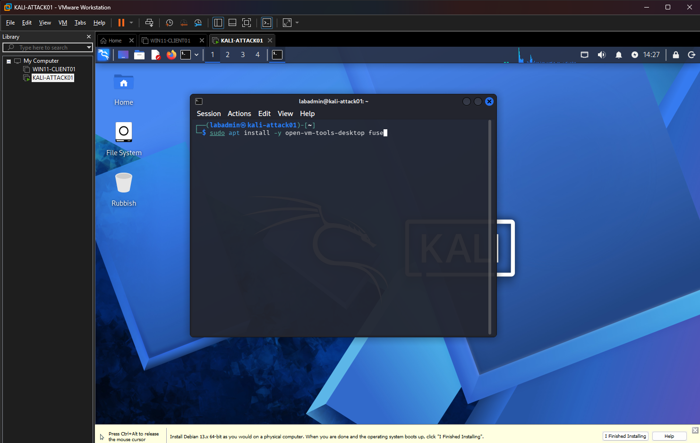

### 26. Configuring VMware Integration

Additional VMware integration components were configured after installation. 

Completing this configuration ensures the virtual machine operates efficiently within the VMware environment.

**Figure 26.** Configuring VMware Integration

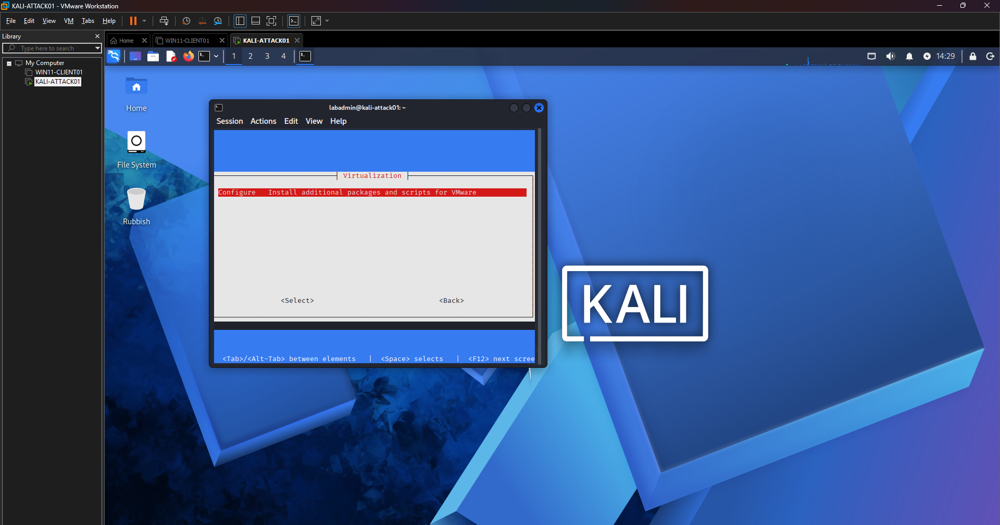

### 27. Verifying Security Tool Installation

The locations of Nmap and Wireshark were verified using the "which" command.

Confirming that these tools were correctly installed establishes the virtual machine's readiness for future reconnaissance and packet analysis exercises.

**Figure 27.** Verifying Security Tool Installation

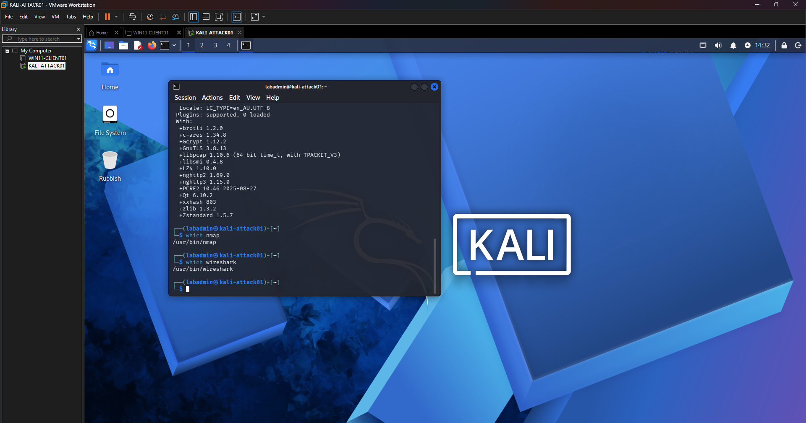

### 28. Performing Final System Validation

A final validation checklist was completed using several Linux commands to confim:

 - Hostname = "hostname"
 - Current User = "whoami" 
 - Operating System = "cat /etc/os-release"
 - Kernel Version = "uname -a"
 - Memory Allocation = "free -h"
 - Disk Utilisation = "df -h"

Completing a final validation before taking a baseline snapshot ensures the virtual machine is operating correctly.

**Figure 28.** Performing Final System Validation

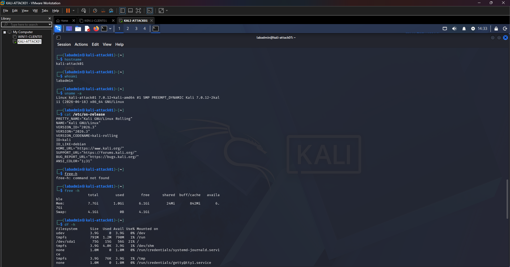

### 29. Creating the Baseline Recovery Snapshot

A VMware snapshot named **Clean Build - Updated and Configured** was created.

This snapshot provides a known-good recovery point that can be restored before future penetration testing, malware simulation or system modification activities.

Maintaining clean baseline snapshots is an important practice in virtualised cybersecurity laboratories, allowing environments to be reset quickly after practical exercises.

**Figure 29.** Creating the Baseline Recover Snapshot

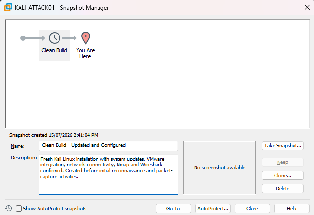

---

## Build Summary

This phase successfully produced a fully configured Kali Linux attacker workstation that will serve as the primary offensive security platform throughout the home lab projects.

The system was manually installed, fully updated, integrated with VMware, validated and documented before a baseline recovery snapshot was created.

The resulting virtual machine now serves as the dedicated attacker workstation within the cybersecurity home lab and provides a stable baseline for future reconnaissance, penetration testing, packet analysis and adversary simulation exercises

This virtual machine now forms one of the core systems within my cybersecurity home lab and will be used extensively throughout future red team, blue team and detection engineering projects
---

## Key Learning Outcomes

During this phase I developed practical experience with:
 - VMware virtual hardware configuration
 - Linux operating system installation
 - Linux partitioning concepts
 - NAT networking within VMware
 - Linux user and hostname configuration
 - System updates and package management using APT
 - Installing VMware Guest Tools
 - Basic Linux validation commands
 - Creating repeatable virtual machine baselines
 - Snapshot management and recovery planning

---

## Challenges Encountered

Several challenges were encounted during the build process. 

The initial Kali virtual machine was created using VMware's pre-built appliance. While functional, it did not provide sufficient installation detail for documentation purposes. The virtual machine was therefore rebuilt from the official installer ISO to produce a complete , repeatable build guide.

Some Linux commands were incorrectly entered, resulting in a return of 'command not found' result. This reinforced the importance of entering Linux commands accurately, including the correct use of spaces, syntax and command-line options, while improving my familiarity with fundamental Linux administration

Additional time was also spent refining screenshot quality, naming conventions and documentation order to ensure the final README followed a logical engineering workflow rather than simply recording installation steps.

Finally, VMware Guest Tool integration required additional package installation and validation before the virtual machine behaved correctly within VMware Workstation.

Resolving these issues improved my understanding of Linux package management, VMware integration and the importance of validating system configuration before creating a baseline snapshot.

---

## Progress So Far

The Cybersecurity Home Lab currently includes:

- [x] Phase 01 - Host Environment Preparation
- [x] Phase 02 - Windows 11 Client Virtual Machine
- [x] Phase 03 - Kali Linux Attacker Virtual Machine

Together these phases establish the core infrastructure required for future offensive and defensive security exercises.

---

## Next Steps

The next phase will transition from building infrastructure to performing practical cybersecurity activities.

Planned exercises include:

 - Network reconnaissance using Nmap
 - Packet capture with Wireshark
 - Firewall configuration testing
 - Port scanning analysis
 - Windows service enumeration
 - Documenting attacker and defender perspectives
 - building repeatable red-team and blue-team investigation scenarios.

---

## Further Development of Infrastructure

The following components will be added to further develop the home lab:

 - Windows Server 2025 Domain Controller
 - Active Directory Domain Services (AD DS)
 - DNS and DHCP configuration
 - Domain-joined Windows Client
 - pfSense Virtual firewall
 - Addition Linux Server Virtual Machines
 - Centralised logging and SIEM platform (Splunk or Wazuh)
 - Sysmon deployment
 - Network segmentation
 - Vulnerable target machines for PenTesting
 - Backup and snapshot strategy

These phases will transform the environment from individual virtual machines into a fully integrated enterprise-style lab.